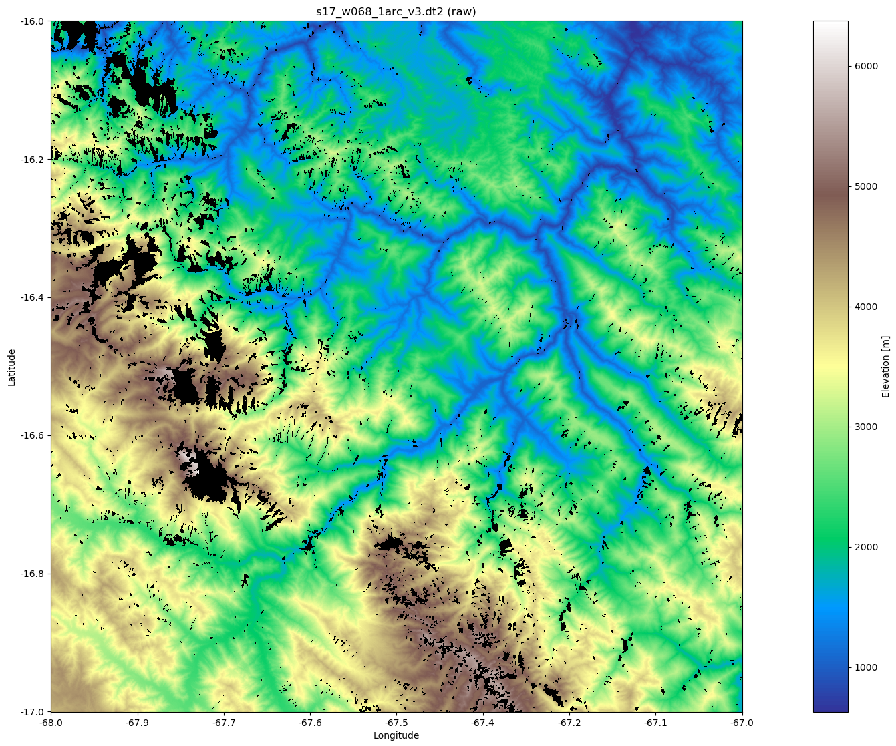
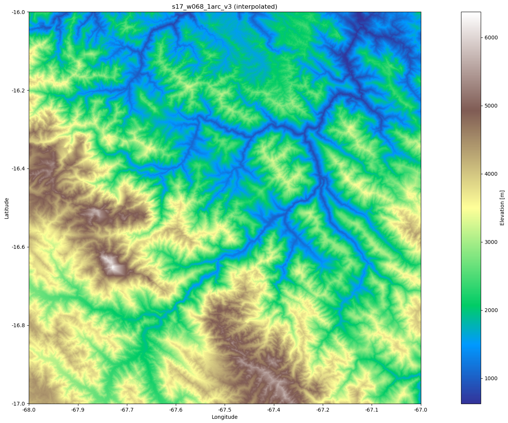
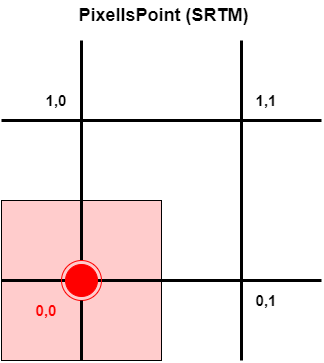
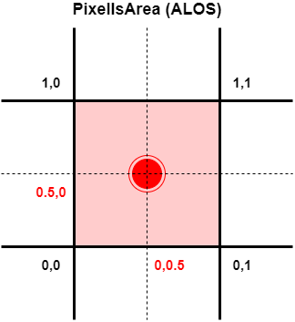
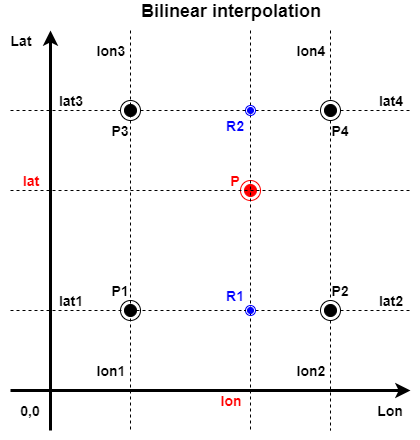
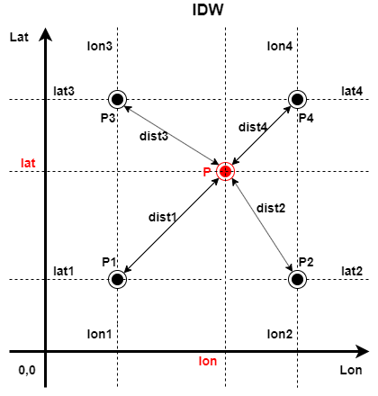
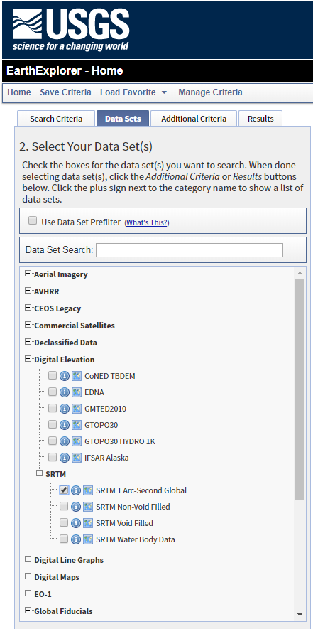

## SRTM1-Global and AW3D30

This repository is a collection of python scripts for parsing and using
[SRTM 1 Arc-Second Global] (30m) elevation data from USGS/NASA and
[ALOS World 3D-30m (AW3D30)] elevation data from &copy; JAXA.

With **`gpxsrtm.py`** you can update the elevations in GPX tracks.

### About SRTM1 data

SRTM ([Shuttle Radar Topography Mission]) data is a collection of topographic
(elevation) data covering nearly 80 percent of Earth's land surfaces. Until
September 2014 it was globaly available only in 90-meter resolution (SRTM3),
but since then a finer 30-meter resolution (SRTM1) is available for the
whole world ([JPL Release 2014-321]).

<table>
<tr><th rowspan=2>Accuracy<br><sup>(90% errors, in meters)</sup></th><th colspan=6>Continent</th></tr>
<tr><td>Africa</td><td>Australia</td><td>Eurasia</td><td>Islands</td><td>N. America</td><td>S. America</td></tr>
<tr><td>Horizontal</td>       <td>11.9</td><td>7.2</td><td>8.8</td><td>9.0</td><td>12.6</td><td>9.0</td></tr>
<tr><td>Absolute Vertical</td><td> 5.6</td><td>6.0</td><td>6.2</td><td>8.0</td><td> 9.0</td><td>6.2</td></tr>
<tr><td>Relative Vertical</td><td> 9.8</td><td>4.7</td><td>8.7</td><td>6.2</td><td> 7.0</td><td>5.5</td></tr>
</table>

<sup>Source: [SRTM Data Validation and Applications]</sup>

[SRTM 1 Arc-Second Global] **void filled** data (tiles) are available for
download via [USGS EarthExplorer] web site. To download the data you need to
register first. The SRTM collections are located under the Digital Elevation
category (see picture at the end).

Because of the availability of finer 30-meter resolution data this set of
tools doesn't deal with coarser SRTM3 data.

### :hand: &nbsp; NOTE: To use the tools you have to download the data yourself!

SRTM1 data downloaded via EarthExlorer is available in three file formats:

1. [Digital Terrain Elevation Data (DTED)] (file size approx. 25 MB/tile)
2. [Band interleaved by line (BIL)] (file size approx. 7 MB/tile)
3. [Georeferenced Tagged Image File Format (GeoTIFF)]  (file size approx. 25 MB/tile)

The tools in this repository recognize and read **all three formats**.

Because of different formats and faster processing of actual tasks the
downloaded data must first be converted to internal Python representation
(pickle) with the supplied tool **`prepare.py`**.

### Interpolation

Preprocessing of data also takes care of possible voids detected in data
(*yes, some tiles may still contain voids!*) with the built-in interpolation
(griddata/linear <sup>[LNDI]</sup>) and extrapolation (k-NN/12 neighbours
<sup>[CKDT]</sup>).

Example of preprocessing a tile with voids:
```
$ prepare.py s17_w068_1arc_v3.dt2
Reading s17_w068_1arc_v3.dt2
Starting point: 17.0 68.0, size: 3601 x 3601
765385 NaN values, interpolating
Interpolating with griddata
Writing s17_w068_1arc_v3.pickle
```

<table><tr>
<td></td>
<td></td>
</tr></table>

### About ALOS data

[ALOS World 3D-30m (AW3D30)] elevation data is a free 30-meters resolution
dataset obtained by resampling of the 5-meter mesh version of the
[World 3D Topographic Data], which is considered to be the most precise
global-scale elevation data at this time.

Current version (v2.2) released in April 2019 is an improved version with
all data voids filled. It's available for download at [AW3D30 DSM data map]
after registration with e-mail confirmation.

ALOS data downloaded via DSM data map is available in [GeoTIFF] format only
(file size approx. 25 MB/tile). The difference from SRTM data is the raster
type, which is [PixelIsPoint] in SRTM data and [PixelIsArea] in ALOS data:

<table><tr>
<td></td>
<td width=80px></td>
<td></td>
</tr></table>

Because of this the ALOS matrix is 3600 x 3600 and needs to be expanded by one
column and line (right and above) from surrounding tiles to be the same size
as SRTM matrix. This can be done with the supplied tool **`extpia.py`**:

```
$ extpia.py N046E015_AVE_DSM.pickle
Reading N046E015_AVE_DSM.pickle
Reading N046E016_AVE_DSM.pickle
Reading N047E015_AVE_DSM.pickle
Reading N047E016_AVE_DSM.pickle
Writing N046E015_AVE_EXT.pickle
```

The resulting `N046E015_AVE_EXT.pickle` is of size 3601 x 3601 and ready to
be used for GPX elevation update.

### GPX elevation update

With **`gpxsrtm.py`** you can update the elevations in GPX tracks.

Example:
```
$ gpxsrtm.py test-s17_w068.gpx
Bounding box: -17 -68 (1 SRTM file)
Reading data/s17_w068_1arc_v3.pickle
Writing test-s17_w068-bil.gpx
```

**`gpxsrtm.py`** expects preprocessed SRTM data files (pickles) in **`data`**
subdirectory, but you can also specify the location from command line (see
**`-h`** switch).

This tool uses the following interpolations (selectable) for calculating
the elevations between the supplied points from SRTM data files:
1. [Bilinear interpolation] (smoother, default)
2. [Inverse Distance Weighting (IDW) interpolation]

<table><tr>
<td></td>
<td width=80px></td>
<td></td>
</tr></table>

### Transportability

Additional tools for converting "pickles" to JSON format (and vice versa) are
available as **`pickle2json.py`** and **`json2pickle.py`**.
The preprocessed data is a matrix of size 3601 x 3601 with the (0, 0)
coordinates in lower left corner with no void/NaN values.

You can also print the data matrix as tab separated values with
**`printdata.py`**.

### USGS EarthExplorer SRTM1 global data selection



[SRTM 1 Arc-Second Global]: https://www.usgs.gov/centers/eros/science/usgs-eros-archive-digital-elevation-shuttle-radar-topography-mission-srtm-1-arc
[Shuttle Radar Topography Mission]: https://www2.jpl.nasa.gov/srtm/mission.htm
[ALOS World 3D-30m (AW3D30)]: https://www.eorc.jaxa.jp/ALOS/en/aw3d30/
[World 3D Topographic Data]: https://www.aw3d.jp/en/
[JPL Release 2014-321]: https://www.jpl.nasa.gov/news/news.php?release=2014-321
[USGS EarthExplorer]: http://earthexplorer.usgs.gov
[AW3D30 DSM data map]: https://www.eorc.jaxa.jp/ALOS/en/aw3d30/data/index.htm
[Digital Terrain Elevation Data (DTED)]: https://www.dlr.de/eoc/en/Portaldata/60/Resources/dokumente/7_sat_miss/SRTM-XSAR-DEM-DTED-1.1.pdf
[Band interleaved by line (BIL)]: http://webhelp.esri.com/arcgisdesktop/9.3/index.cfm?topicname=BIL,_BIP,_and_BSQ_raster_files
[Georeferenced Tagged Image File Format (GeoTIFF)]: https://nanopdf.com/downloadFile/irs-p6-awifs-product-geotiff-format-description_pdf
[GeoTIFF]: https://nanopdf.com/downloadFile/irs-p6-awifs-product-geotiff-format-description_pdf
[PixelIsPoint]: http://docs.opengeospatial.org/is/19-008r4/19-008r4.html#_requirements_class_gtrastertypegeokey
[PixelIsArea]: http://docs.opengeospatial.org/is/19-008r4/19-008r4.html#_requirements_class_gtrastertypegeokey
[SRTM Data Validation and Applications]: https://www.researchgate.net/profile/Vijith_H/post/What_is_the_vertical_resolutionaccuracy_of_Global_SRTM_1_arc_second_30_m2/attachment/59d6407179197b807799ca7e/AS%3A431123886022658%401479799352926/download/SRTM-program-final-version.pdf
[Bilinear interpolation]: https://en.wikipedia.org/wiki/Bilinear_interpolation
[Inverse Distance Weighting (IDW) interpolation]: https://en.wikipedia.org/wiki/Inverse_distance_weighting
[LNDI]: https://docs.scipy.org/doc/scipy/reference/generated/scipy.interpolate.LinearNDInterpolator.html
[CKDT]: https://docs.scipy.org/doc/scipy/reference/generated/scipy.spatial.cKDTree.html